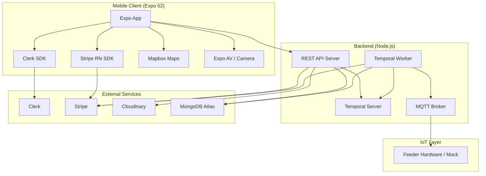
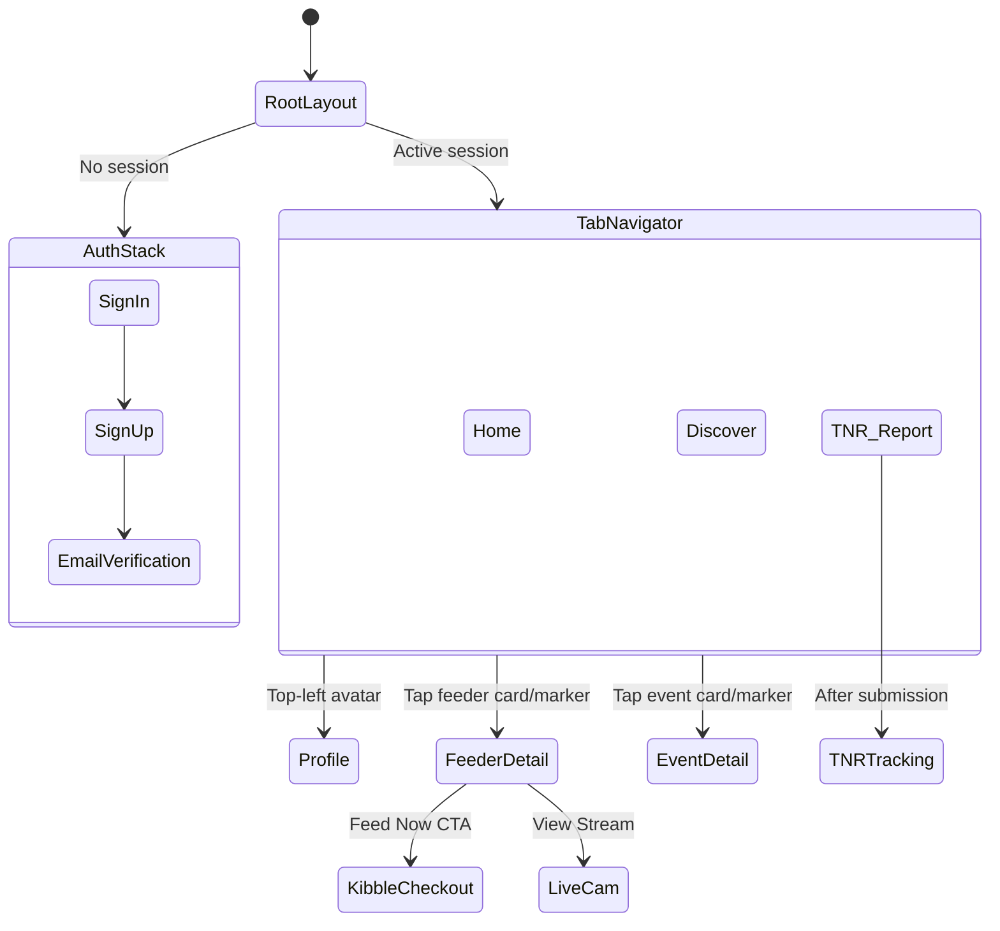
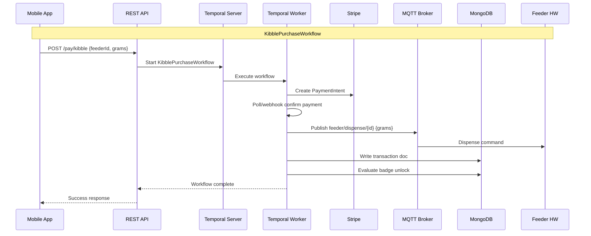
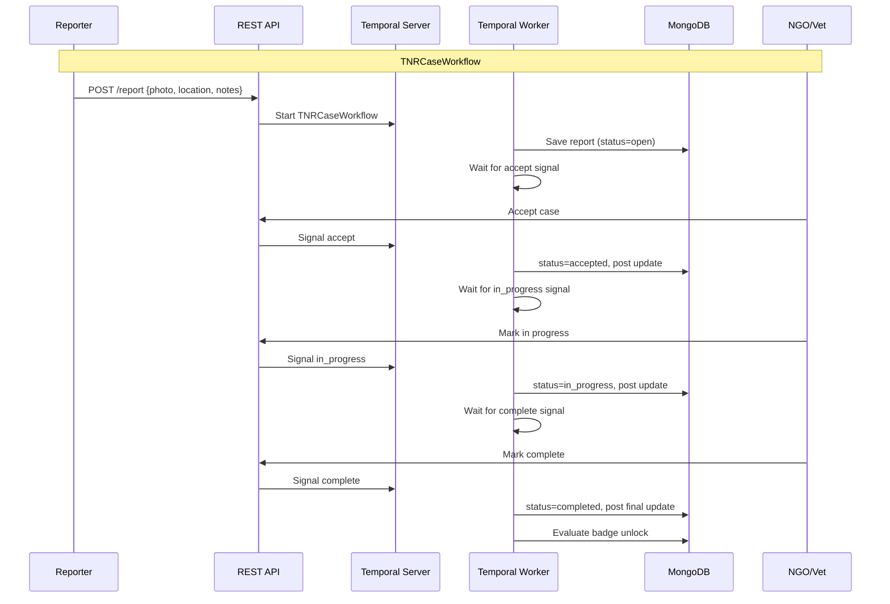
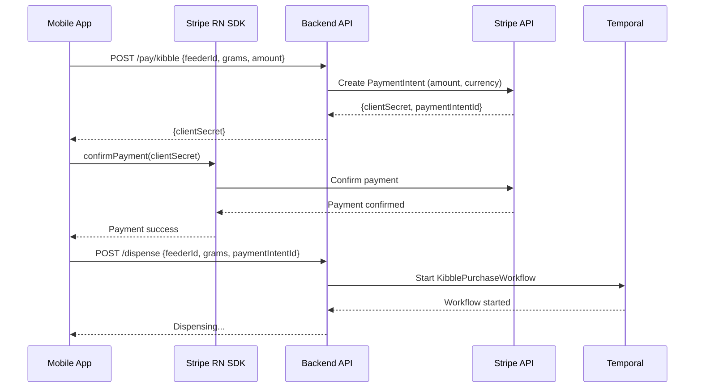
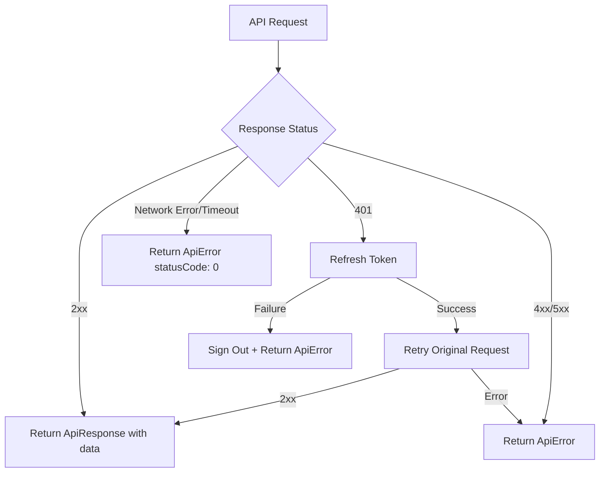
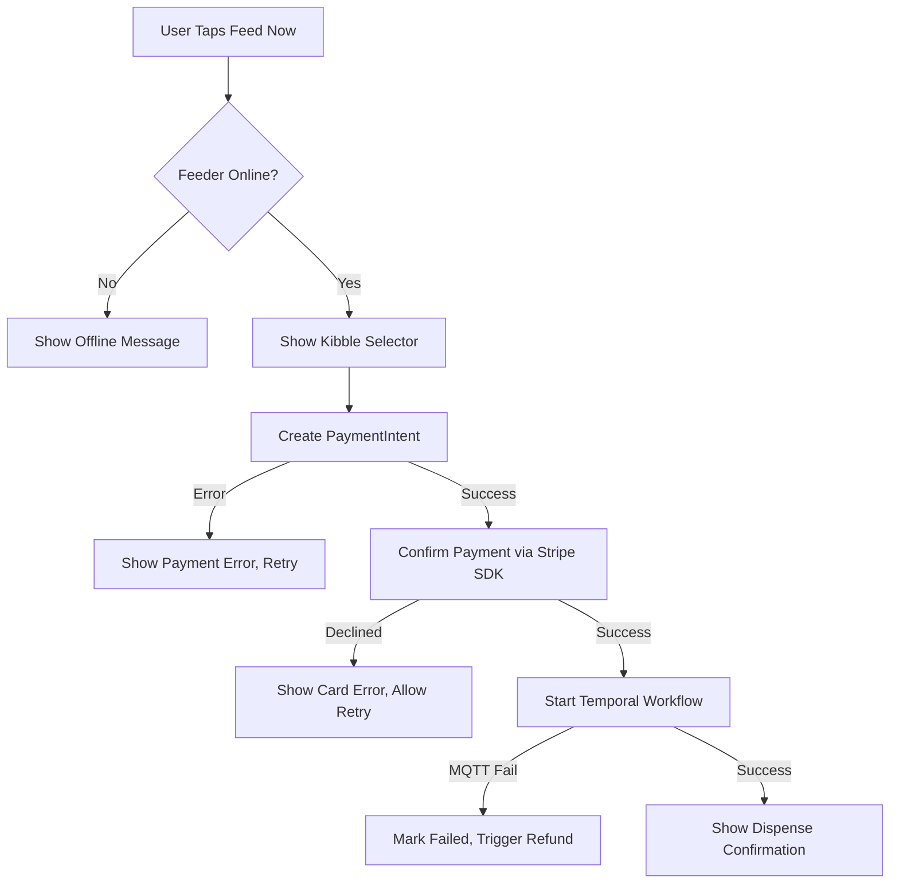
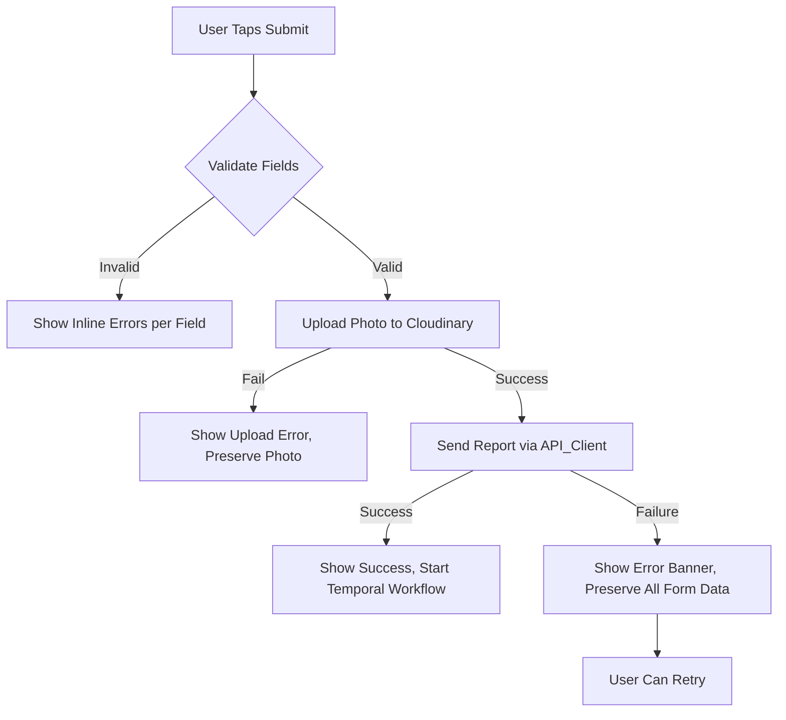

# Design Document: Pawven App

## Overview

Pawven is a community-driven mobile application for animal welfare enthusiasts, focusing on community cat management, IoT-enabled feeding, local event coordination, and Trap-Neuter-Return (TNR) case tracking. The app connects caretakers with smart feeders, NGOs, veterinary clinics, and community events through a rich mobile experience with map-based discovery.

### Tech Stack

| Layer | Technology |
|-------|-----------|
| Framework | Expo 52 + React Native |
| Language | TypeScript |
| Navigation | Expo Router (file-based) |
| Styling | NativeWind / Tailwind CSS |
| State Management | Zustand + AsyncStorage |
| Authentication | Clerk |
| Maps | @rnmapbox/maps (Mapbox) |
| Payments | Stripe (stripe-node + @stripe/stripe-react-native) |
| Camera/Media | Expo Camera + Expo AV |
| Backend | Expo API Routes / Express (Node.js) |
| Database | MongoDB Atlas + Mongoose |
| Photo Storage | Cloudinary |
| IoT Protocol | MQTT (mqtt.js) |
| Workflow Orchestration | Temporal |
| Security | Aikido Security |

### Key Design Decisions

1. **Expo Router file-based routing** — Routes defined by filesystem under `app/`, enabling automatic deep linking, type-safe navigation, and clean separation of auth/tab/detail flows via route groups.

2. **Clerk for authentication** — Managed email/password auth with built-in email verification, token rotation, and SecureStore integration for persistent sessions. Supports role-based access (standard, NGO, vet).

3. **Temporal for workflow orchestration** — Durable execution engine for multi-step business processes (kibble purchase → payment → MQTT dispense → transaction recording, TNR case lifecycle). Handles retries, timeouts, and exactly-once semantics without custom state machines.

4. **MQTT for IoT communication** — Lightweight pub/sub protocol for feeder dispense commands. Backend publishes to `feeder/dispense/{id}` topic after confirmed payment. Supports hardware fallback via mock MQTT server for development.

5. **@rnmapbox/maps for spatial discovery** — Native Mapbox GL integration with GeoJSON marker clustering, custom marker types (Feeder, Event, NGO, Vet), and bottom sheet interaction on marker tap.

6. **Stripe for payments** — Server-side PaymentIntent creation with client-side confirmation via `@stripe/stripe-react-native`. Supports kibble purchases, donations, and feeder rentals.

7. **MongoDB with GeoJSON** — Document-oriented storage with native `2dsphere` indexing for proximity queries. Each location-aware entity stores coordinates as GeoJSON Point.

8. **Cloudinary for photo storage** — Managed image upload/transformation for TNR stray photos, event cover photos, and org logos. Client uploads directly with signed URLs.

## Architecture

### High-Level System Architecture



### Navigation Structure



### Temporal Workflow Architecture





### Payment Flow (Stripe)



## Components and Interfaces

### Folder Structure

```
app/
  _layout.tsx              — Root layout (Clerk provider, auth check)
  (auth)/
    _layout.tsx            — Headerless stack
    sign-in.tsx            — Sign in screen
    sign-up.tsx            — Sign up + email verification
  (tabs)/
    _layout.tsx            — Bottom tab bar (Home, Discover, TNR)
    home.tsx               — Event feed + update threads
    discover.tsx           — Card feed + map toggle
    tnr.tsx                — TNR report form
  profile.tsx              — User profile (modal)
  feeder/
    [id].tsx               — Feeder detail (live cam, kibble purchase)
    checkout.tsx           — Kibble selector + Stripe checkout
  tnr/
    [id].tsx               — TNR case tracking + update thread
  activity/
    [id].tsx               — Event detail + RSVP
components/
  ui/
    index.ts               — Barrel export
    Card.tsx               — Styled card container
    Badge.tsx              — Color-coded category badge
    FilterPill.tsx         — Tappable filter toggle
    BottomSheet.tsx        — Map marker detail sheet
    KibbleSelector.tsx     — Gram amount picker (10g/20g/50g/100g)
  feed/
    EventCard.tsx          — Home feed event card
    UpdateThread.tsx       — Chronological update list
  map/
    MapView.tsx            — Mapbox wrapper with markers
    MarkerCluster.tsx      — Clustered marker group
    FeederMarker.tsx       — Feeder-specific marker icon
    EventMarker.tsx        — Event-specific marker icon
    OrgMarker.tsx          — NGO/Vet marker icon
  feeder/
    LiveCamView.tsx        — RTSP/WebRTC stream player
    DispenseStatus.tsx     — Dispensing progress indicator
constants/
  Colors.ts                — Color palette (nature-toned)
  Config.ts                — API URLs, timeouts, MQTT broker
  MapStyles.ts             — Mapbox style URLs and defaults
data/
  feeders.ts               — Mock feeder data (min 5 records)
  events.ts                — Mock event data (min 5 records)
  organizations.ts         — Mock org data (min 3 records)
hooks/
  useLocation.ts           — Expo Location permission + coordinates
  useMQTT.ts              — MQTT connection + subscription
  useFeederStream.ts       — Live cam stream management
lib/
  api.ts                   — REST client with auth interceptor
  temporal-client.ts       — Temporal workflow trigger client
  cloudinary.ts            — Photo upload utilities
  mqtt.ts                  — MQTT publish/subscribe helpers
  auth/
    token-cache.ts         — Clerk SecureStore persistence
store/
  auth-store.ts            — Auth session state
  feeder-store.ts          — Feeder list + status
  cart-store.ts            — Kibble cart state
  badge-store.ts           — User badges/achievements
  tnr-store.ts             — TNR reports + drafts
types/
  index.ts                 — All TypeScript interfaces
assets/
  images/                  — Static images
  icons/                   — Custom tab/marker icons
  animations/              — Lottie animations
```

### Screen Components

| Component | Route | Responsibility |
|-----------|-------|----------------|
| `RootLayout` | `app/_layout.tsx` | Clerk provider, session check, conditional routing |
| `AuthLayout` | `app/(auth)/_layout.tsx` | Headerless stack for sign-in/sign-up |
| `TabLayout` | `app/(tabs)/_layout.tsx` | Bottom tab bar with Home, Discover, TNR |
| `SignInScreen` | `app/(auth)/sign-in.tsx` | Email/password login form |
| `SignUpScreen` | `app/(auth)/sign-up.tsx` | Registration + email verification |
| `HomeScreen` | `app/(tabs)/home.tsx` | Event feed, pull-to-refresh, update threads |
| `DiscoverScreen` | `app/(tabs)/discover.tsx` | Card feed + map toggle, filter pills |
| `TNRScreen` | `app/(tabs)/tnr.tsx` | TNR report submission form |
| `ProfileScreen` | `app/profile.tsx` | User info, badges summary, sign-out |
| `FeederDetailScreen` | `app/feeder/[id].tsx` | Live cam, kibble selector, dispense history |
| `CheckoutScreen` | `app/feeder/checkout.tsx` | Stripe payment confirmation |
| `TNRTrackingScreen` | `app/tnr/[id].tsx` | Case status + update thread |
| `ActivityDetailScreen` | `app/activity/[id].tsx` | Event details + RSVP |

### Shared UI Components

| Component | Props | Responsibility |
|-----------|-------|----------------|
| `Card` | `children`, `style?`, `onPress?` | Styled container (border-radius, padding, shadow) |
| `Badge` | `label`, `category`, `size?` | Color-coded category/status pill |
| `FilterPill` | `label`, `active`, `onChange` | Tappable filter toggle |
| `BottomSheet` | `visible`, `onDismiss`, `children` | Slide-up sheet for map marker details |
| `KibbleSelector` | `amounts[]`, `selected`, `onSelect`, `quantity`, `onQuantityChange` | Gram picker + qty control |

### Backend API Endpoints

| Domain | Method | Endpoint | Description |
|--------|--------|----------|-------------|
| Feeders | GET | `/feeders` | List all feeders with status |
| Feeders | POST | `/dispense` | Trigger dispense (after payment) |
| Events | GET | `/events` | List events with filters |
| Events | POST | `/events` | Create event (host only) |
| Events | POST | `/events/:id/rsvp` | RSVP to event |
| Events | POST | `/events/:id/updates` | Post event update |
| Orgs | GET | `/orgs` | List organizations |
| Orgs | GET | `/orgs/:id` | Organization detail |
| TNR | POST | `/report` | Submit TNR report → starts workflow |
| TNR | PATCH | `/reports/:id` | Update report status (NGO/Vet) |
| TNR | GET | `/reports` | List user's reports |
| TNR | GET | `/reports/:id/updates` | Get case update thread |
| TNR | POST | `/reports/:id/updates` | Post case update |
| Payment | POST | `/pay/kibble` | Create kibble PaymentIntent |
| Payment | POST | `/pay/donate` | Create donation PaymentIntent |
| Payment | POST | `/pay/rental` | Create feeder rental subscription |

### Zustand Stores

| Store | State Shape | Key Actions |
|-------|-------------|-------------|
| `authStore` | `{ session, user, loading, error }` | `signIn`, `signOut`, `refreshSession` |
| `feederStore` | `{ feeders[], loading, error }` | `fetchFeeders`, `refreshFeeders`, `clearFeeders` |
| `cartStore` | `{ items[], total }` | `addItem`, `removeItem`, `updateQuantity`, `clearCart` |
| `badgeStore` | `{ badges[], loading, error }` | `fetchBadges`, `refreshBadges` |
| `tnrStore` | `{ history[], draft, loading, error }` | `createDraft`, `updateDraft`, `discardDraft`, `submitReport` |

## Data Models

### MongoDB Collections

```typescript
// MongoDB document schemas (Mongoose)

// users collection
interface UserDoc {
  _id: ObjectId;
  uid: string;           // Clerk user ID
  email: string;
  name: string;
  role: 'standard' | 'ngo' | 'vet';
  verified: boolean;
  profileImageUrl: string | null;
  createdAt: Date;
  updatedAt: Date;
}

// feeders collection
interface FeederDoc {
  _id: ObjectId;
  name: string;
  location: {
    type: 'Point';
    coordinates: [number, number]; // [lng, lat]
  };
  status: 'online' | 'offline';
  kibbleLevel: number;       // percentage 0-100
  lastDispensed: Date | null;
  ownerId: ObjectId;         // user who owns/rents
  mqttTopic: string;         // e.g. "feeder/dispense/abc123"
  streamUrl: string | null;  // RTSP/WebRTC URL for live cam
  createdAt: Date;
}

// events collection
interface EventDoc {
  _id: ObjectId;
  title: string;
  description: string;
  coverPhotoUrl: string;
  location: {
    type: 'Point';
    coordinates: [number, number];
  };
  startTime: Date;
  endTime: Date;
  hostUserId: ObjectId;
  rsvpCount: number;
  status: 'upcoming' | 'live' | 'completed' | 'cancelled';
  category: 'adoption' | 'feeding' | 'tnr' | 'fundraiser' | 'meetup' | 'volunteer';
  createdAt: Date;
}

// rsvps collection
interface RsvpDoc {
  _id: ObjectId;
  eventId: ObjectId;
  userId: ObjectId;
  createdAt: Date;
}

// orgs collection
interface OrgDoc {
  _id: ObjectId;
  name: string;
  type: 'ngo' | 'vet';
  logoUrl: string;
  description: string;
  contact: {
    phone: string;
    email: string;
    website: string | null;
  };
  hours: string;          // e.g. "Mon-Fri 9AM-6PM"
  donateUrl: string | null;
  location: {
    type: 'Point';
    coordinates: [number, number];
  };
  createdAt: Date;
}

// tnr_reports collection
interface TNRReportDoc {
  _id: ObjectId;
  strayPhotoUrl: string;
  location: {
    type: 'Point';
    coordinates: [number, number];
  };
  notes: string;              // max 500 chars
  activityType: 'trapped' | 'neutered' | 'returned' | 'feeding' | 'sighting';
  reportedBy: ObjectId;
  assignedTo: ObjectId | null;  // NGO or Vet user
  status: 'open' | 'accepted' | 'in_progress' | 'completed';
  temporalWorkflowId: string | null;
  createdAt: Date;
  updatedAt: Date;
}

// updates collection (shared thread model)
interface UpdateDoc {
  _id: ObjectId;
  threadType: 'report' | 'event';
  threadId: ObjectId;        // references tnr_reports._id or events._id
  authorId: ObjectId;
  message: string;
  createdAt: Date;
}

// badges collection
interface BadgeDoc {
  _id: ObjectId;
  userId: ObjectId;
  badgeId: string;           // e.g. "first_feeder", "cat_whisperer"
  unlockedAt: Date;
}

// transactions collection
interface TransactionDoc {
  _id: ObjectId;
  userId: ObjectId;
  type: 'kibble' | 'rental' | 'donation';
  amount: number;            // cents
  currency: string;
  stripePaymentIntentId: string;
  feederId: ObjectId | null; // for kibble transactions
  status: 'pending' | 'completed' | 'failed';
  createdAt: Date;
}

// feeder_rentals collection
interface FeederRentalDoc {
  _id: ObjectId;
  userId: ObjectId;
  feederId: ObjectId;
  stripeSubscriptionId: string;
  status: 'active' | 'cancelled' | 'past_due';
  startDate: Date;
  endDate: Date | null;
}
```

### Client-Side TypeScript Interfaces

```typescript
// types/index.ts

interface User {
  id: string;
  email: string;
  name: string;
  role: 'standard' | 'ngo' | 'vet';
  imageUrl: string | null;
  verified: boolean;
}

interface GeoLocation {
  latitude: number;
  longitude: number;
  address?: string;
}

interface Feeder {
  id: string;
  name: string;
  location: GeoLocation;
  status: 'online' | 'offline';
  kibbleLevel: number;
  lastDispensed: string | null;  // ISO 8601
  streamUrl: string | null;
}

interface Event {
  id: string;
  title: string;
  description: string;
  coverPhotoUrl: string;
  location: GeoLocation;
  startTime: string;       // ISO 8601
  endTime: string;         // ISO 8601
  hostUserId: string;
  hostName: string;
  rsvpCount: number;
  status: 'upcoming' | 'live' | 'completed' | 'cancelled';
  category: EventCategory;
  createdAt: string;
}

type EventCategory = 'adoption' | 'feeding' | 'tnr' | 'fundraiser' | 'meetup' | 'volunteer';

interface Organization {
  id: string;
  name: string;
  type: 'ngo' | 'vet';
  logoUrl: string;
  description: string;
  contact: { phone: string; email: string; website: string | null };
  hours: string;
  donateUrl: string | null;
  location: GeoLocation;
}

interface TNRReport {
  id: string;
  strayPhotoUrl: string;
  location: GeoLocation;
  notes: string;
  activityType: TNRActivityType;
  status: TNRStatus;
  reportedBy: string;
  assignedTo: string | null;
  createdAt: string;
}

type TNRActivityType = 'trapped' | 'neutered' | 'returned' | 'feeding' | 'sighting';
type TNRStatus = 'open' | 'accepted' | 'in_progress' | 'completed';

interface TNRDraft {
  location: GeoLocation | null;
  strayPhotoUrl: string | null;
  notes: string;
  activityType: TNRActivityType | null;
}

interface UpdateMessage {
  id: string;
  threadType: 'report' | 'event';
  threadId: string;
  authorId: string;
  authorName: string;
  message: string;
  createdAt: string;
}

interface CartItem {
  feederId: string;
  feederName: string;
  grams: 10 | 20 | 50 | 100;
  quantity: number;
  pricePerUnit: number;    // cents
}

interface Badge {
  id: string;
  badgeId: string;
  name: string;
  description: string;
  iconUrl: string;
  unlockedAt: string;
}

interface Transaction {
  id: string;
  type: 'kibble' | 'rental' | 'donation';
  amount: number;
  currency: string;
  status: 'pending' | 'completed' | 'failed';
  createdAt: string;
}

// Discover filter categories
type DiscoverFilter = 'all' | 'feeders' | 'events' | 'ngos' | 'vets';

// Map marker union type
interface MapMarker {
  id: string;
  type: 'feeder_online' | 'feeder_offline' | 'event_upcoming' | 'event_live' | 'ngo' | 'vet';
  location: GeoLocation;
  title: string;
  subtitle: string;
  ctaLabel: string | null;  // null for offline feeders
}

// API error response
interface ApiError {
  statusCode: number;      // 0 for network errors
  message: string;
  retry: boolean;
}

interface ApiResponse<T> {
  data: T | null;
  error: ApiError | null;
}

// Color Palette
interface ColorPalette {
  primary: string;         // Deep forest green (#2D5016)
  secondary: string;       // Warm brown (#8B4513)
  background: string;      // Cream (#FFF8F0)
  surface: string;         // Light sage (#E8F0E0)
  accent: string;          // Warm orange (#E8740C)
  text: string;            // Dark charcoal (#1A1A1A)
  textSecondary: string;   // Muted olive (#5C6B4A)
  border: string;          // Soft tan (#D4C5A0)
  active: string;          // Vibrant green (#4CAF50)
  disabled: string;        // Muted gray (#B0B0B0)
}
```

### Badges System

| Badge ID | Name | Criteria | Category |
|----------|------|----------|----------|
| `first_feeder` | First Feeder | First kibble purchase | Feeding |
| `cat_whisperer` | Cat Whisperer | Feed 10× via online feeder | Feeding |
| `tnr_hero` | TNR Hero | Complete first TNR request | TNR |
| `community_trapper` | Community Trapper | 5 TNR operations | TNR |
| `volunteer_star` | Volunteer Star | Join or host 3 activities | Volunteering |
| `big_heart` | Big Heart | Donate to NGO/TNR campaign | Donation |
| `guardian_angel` | Guardian Angel | 50 total stray care actions | Milestone |

Badge evaluation occurs as the final step of Temporal workflows (KibblePurchaseWorkflow and TNRCaseWorkflow). The worker queries the user's aggregate stats and unlocks any newly qualified badges.

### Map Marker Types & Interactions

| Marker Type | Visual | Bottom Sheet Content | CTA |
|-------------|--------|---------------------|-----|
| Feeder (online) | 🐱 green | Name, kibble level, last dispensed | "Feed Now" |
| Feeder (offline) | 🐱 gray | Name, last seen online | — |
| Event (upcoming) | 📅 blue | Cover photo, host, title, date, RSVP count | "RSVP" |
| Event (live) | 📅 green pulse | Same + "Happening Now" badge | "Join" |
| NGO | 🏢 amber | Logo, name, mission, contact, hours | "Donate" (ext link) |
| Vet | 🏥 red | Logo, clinic, specialisation, contact, hours | "Donate" (ext link) |

### Store State Shapes

```typescript
// Auth Store
interface AuthState {
  session: User | null;
  loading: boolean;
  error: string | null;
  signIn: (email: string, password: string) => Promise<void>;
  signOut: () => Promise<void>;
  refreshSession: () => Promise<void>;
}

// Feeder Store
interface FeederState {
  feeders: Feeder[];
  loading: boolean;
  error: string | null;
  fetchFeeders: () => Promise<void>;
  refreshFeeders: () => Promise<void>;
  clearFeeders: () => void;
}

// Cart Store
interface CartState {
  items: CartItem[];
  total: number;           // computed from items
  addItem: (item: Omit<CartItem, 'quantity'>) => void;
  removeItem: (feederId: string, grams: number) => void;
  updateQuantity: (feederId: string, grams: number, quantity: number) => void;
  clearCart: () => void;
}

// Badge Store
interface BadgeState {
  badges: Badge[];
  loading: boolean;
  error: string | null;
  fetchBadges: () => Promise<void>;
  refreshBadges: () => Promise<void>;
}

// TNR Store
interface TNRState {
  history: TNRReport[];
  draft: TNRDraft | null;
  loading: boolean;
  error: string | null;
  createDraft: () => void;
  updateDraft: (fields: Partial<TNRDraft>) => void;
  discardDraft: () => void;
  submitReport: () => Promise<void>;
}
```

## Correctness Properties

*A property is a characteristic or behavior that should hold true across all valid executions of a system — essentially, a formal statement about what the system should do. Properties serve as the bridge between human-readable specifications and machine-verifiable correctness guarantees.*

### Property 1: Event feed ordering and pagination

*For any* collection of events with varying `createdAt` timestamps, the Home_Feed sorting logic SHALL return events ordered by most recent `createdAt` first, and the result set SHALL contain at most 20 items per batch.

**Validates: Requirements 4.1**

### Property 2: Filter preservation across view toggle

*For any* set of active filter selections on the Discover_Screen, toggling from card feed view to map view and back to card feed view SHALL preserve all previously active filter selections unchanged.

**Validates: Requirements 5.4**

### Property 3: Filter correctness

*For any* dataset of events, feeders, and organizations, and any selected DiscoverFilter category, all items displayed in both the card feed and map view SHALL have a type matching the selected filter. No items with a non-matching type SHALL appear in the results.

**Validates: Requirements 5.5**

### Property 4: TNR description length validation

*For any* string provided as `notes` in the TNR form, if its character length exceeds 500, the form validation SHALL reject the submission. If the length is between 1 and 500 characters inclusive, the description SHALL be accepted as valid.

**Validates: Requirements 6.2**

### Property 5: TNR required field validation

*For any* combination of TNR form fields where one or more required fields (location, notes, activityType) are null or empty, the form validation SHALL produce exactly one validation error per missing field. The total number of validation errors SHALL equal the number of empty/null required fields.

**Validates: Requirements 6.4**

### Property 6: TNR form data preservation on failure

*For any* valid TNR form state (with all fields populated), if the API_Client submission fails, all form field values SHALL remain identical to their pre-submission state — no field is cleared or modified.

**Validates: Requirements 6.6**

### Property 7: Badge category-to-color mapping consistency

*For any* badge category value, the Badge_Component SHALL render with a color from the Color_Palette that is deterministic — the same category SHALL always produce the same color, and distinct categories SHALL map to distinct colors.

**Validates: Requirements 7.2**

### Property 8: FilterPill toggle behavior

*For any* initial active state (true or false) of a FilterPill_Component, tapping it SHALL result in the active state being the logical negation of the initial state, and the onChange callback SHALL be invoked exactly once with the new toggled value.

**Validates: Requirements 7.4**

### Property 9: Cart state invariants

*For any* sequence of cart operations (addItem, removeItem, updateQuantity, clearCart), the Cart_Store SHALL maintain these invariants: (a) no item SHALL have a quantity less than 1 after any operation, (b) addItem for a new feederId+grams combination SHALL increase items array length by 1, (c) addItem for an existing feederId+grams combination SHALL increment its quantity by 1, (d) removeItem SHALL decrease items array length by 1, and (e) clearCart SHALL result in an empty items array.

**Validates: Requirements 9.3**

### Property 10: TNR draft lifecycle consistency

*For any* sequence of TNR draft operations, the TNR_Store SHALL maintain: (a) createDraft produces a non-null draft with all fields at their default empty values, (b) updateDraft modifies only the specified fields leaving all other fields unchanged, (c) discardDraft sets draft to null, (d) submitReport on a complete draft moves it into the history array and sets draft to null.

**Validates: Requirements 9.5**

### Property 11: Store fetch error preserves existing data

*For any* Zustand store (Feeder, Badge, TNR) that currently holds loaded data, if a subsequent fetch operation fails, the store SHALL retain all previously loaded data items unchanged and SHALL expose a non-null error string describing the failure.

**Validates: Requirements 9.7**

### Property 12: API Client auth header injection

*For any* HTTP request (GET, POST, PUT, or DELETE) made through the API_Client while a user session is active, the outgoing request headers SHALL contain an `Authorization` header with the current session token value.

**Validates: Requirements 10.2**

### Property 13: API Client network error structure

*For any* API request that encounters a network error or exceeds the 30-second timeout, the API_Client SHALL return an ApiError object with `statusCode` equal to 0, a non-empty `message` string, and a `retry` boolean field.

**Validates: Requirements 10.3**

### Property 14: Mock data schema conformance

*For any* record in the mock data files (feeders, events, organizations), the record SHALL contain all required fields defined in the corresponding TypeScript interface with values of the correct type and no undefined required fields.

**Validates: Requirements 12.2**

## Error Handling

### Error Categories

| Category | Source | Handling Strategy |
|----------|--------|-------------------|
| Network errors | API_Client timeout or connectivity failure | Return `ApiError` with `statusCode: 0`, display user-friendly message, preserve form data, offer retry |
| Authentication errors | Clerk auth failures, invalid credentials | Display specific error from Clerk, remain on current screen, preserve form inputs |
| Authorization errors | 401 responses from backend | Auto-refresh token via Auth_Store, retry request once; if refresh fails, sign out user |
| Validation errors | Form input validation (TNR, sign-up) | Display inline error messages adjacent to invalid fields, do not submit to backend |
| Payment errors | Stripe PaymentIntent failures | Display payment-specific error, allow retry without re-entering card details |
| Workflow errors | Temporal workflow failures (dispense, TNR) | Mark transaction as failed, notify user, allow manual retry |
| IoT errors | MQTT publish failure or feeder offline | Check feeder status before dispense, show "feeder offline" state, refund if payment completed |
| Data loading errors | Failed store fetches | Set store `error` state, preserve previously loaded data, expose retry action |
| Location errors | Permission denial or GPS timeout | Return null from Location_Hook, consuming components fall back to default/manual behavior |
| Upload errors | Cloudinary photo upload failure | Display retry option, preserve selected photo in memory |

### Error Flow: API Client



### Error Flow: Kibble Purchase



### Error Flow: TNR Form Submission



### Error Display Patterns

- **Inline errors**: Adjacent to specific field that failed validation (TNR form, auth forms)
- **Banner errors**: Top-of-screen dismissible banner for network/server errors (Home_Feed, Discover)
- **Full-screen error state**: When primary content cannot load (empty feed + error message + retry button)
- **Toast notifications**: Brief success/info confirmations (report submitted, kibble dispensed, badge unlocked)
- **Bottom sheet errors**: Payment failures shown in the checkout bottom sheet with retry option
- **Modal alerts**: Critical errors requiring acknowledgment (session expired, feeder went offline during purchase)

### Data Preservation Rules

1. **Form data on network failure**: All entered form fields preserved — user never loses typed content
2. **Store data on refresh failure**: Previously loaded lists (feeders, events, badges) remain in state
3. **Filter state on error**: Active filter selections preserved even if filtered results fail to load
4. **TNR draft on navigation**: Draft persists in Zustand state across screen navigations
5. **Cart on payment failure**: Cart items preserved for retry without re-selection
6. **Photo on upload failure**: Selected photo remains in memory for retry

## Testing Strategy

### Testing Framework

- **Test Runner**: Jest with `jest-expo` preset
- **Component Testing**: React Native Testing Library (`@testing-library/react-native`)
- **Property-Based Testing**: `fast-check` (minimum 100 iterations per property test)
- **Mocking**: Jest built-in mocks for API_Client, Clerk, Expo Location, Stripe SDK, MQTT

### Test Categories

#### Property-Based Tests

Each correctness property maps to a dedicated `fast-check` test. Property tests validate universal behaviors across generated inputs. Each test runs a minimum of 100 iterations and is tagged with a comment referencing the design property.

Tag format: `// Feature: pawven-app, Property {N}: {title}`

| Property | Test File | What's Generated |
|----------|-----------|-----------------|
| P1: Event ordering | `__tests__/properties/home-feed.property.test.ts` | Random arrays of Event objects with varying createdAt dates |
| P2: Filter preservation | `__tests__/properties/discover-filters.property.test.ts` | Random filter selection sets + toggle sequences |
| P3: Filter correctness | `__tests__/properties/discover-filters.property.test.ts` | Random items with categories + filter selections |
| P4: TNR description length | `__tests__/properties/tnr-validation.property.test.ts` | Random strings of length 0–1000 |
| P5: TNR required fields | `__tests__/properties/tnr-validation.property.test.ts` | Random subsets of required fields set to empty/null |
| P6: TNR form preservation | `__tests__/properties/tnr-validation.property.test.ts` | Random valid form states + simulated failures |
| P7: Badge color mapping | `__tests__/properties/badge.property.test.ts` | All badge category values, pairs of categories |
| P8: FilterPill toggle | `__tests__/properties/filter-pill.property.test.ts` | Random initial boolean states |
| P9: Cart invariants | `__tests__/properties/cart-store.property.test.ts` | Random cart states + operation sequences |
| P10: TNR draft lifecycle | `__tests__/properties/tnr-store.property.test.ts` | Random draft operation sequences |
| P11: Store error preservation | `__tests__/properties/store-error.property.test.ts` | Random store states + simulated fetch failures |
| P12: Auth header injection | `__tests__/properties/api-client.property.test.ts` | Random HTTP methods, paths, bodies, tokens |
| P13: Network error structure | `__tests__/properties/api-client.property.test.ts` | Random requests + simulated network failures |
| P14: Mock data schema | `__tests__/properties/mock-data.property.test.ts` | All records from mock data files |

#### Unit Tests (Example-Based)

| Area | Test File | Key Scenarios |
|------|-----------|---------------|
| Auth routing | `__tests__/unit/root-layout.test.tsx` | Unauthenticated → Auth_Stack, authenticated → Tab_Navigator |
| Sign-in flow | `__tests__/unit/sign-in.test.tsx` | Valid credentials success, invalid credentials error, network error with form preservation |
| Sign-up flow | `__tests__/unit/sign-up.test.tsx` | Valid registration, duplicate email error, email verification flow |
| Profile screen | `__tests__/unit/profile.test.tsx` | Displays user info, sign-out action, error + retry |
| Tab navigator | `__tests__/unit/tab-navigator.test.tsx` | Three tabs render, active tab styling, default to Home |
| Home feed | `__tests__/unit/home-feed.test.tsx` | Cards render, pull-to-refresh, empty state, error state |
| Discover screen | `__tests__/unit/discover.test.tsx` | Map toggle, location centering, default view on denial, marker tap → bottom sheet |
| TNR form | `__tests__/unit/tnr-form.test.tsx` | Location pre-fill, photo upload, submission success, manual location entry |
| Feeder detail | `__tests__/unit/feeder-detail.test.tsx` | Online/offline states, kibble selector, stream display |
| Location hook | `__tests__/unit/use-location.test.ts` | Permission grant, denial, timeout fallback |
| API client | `__tests__/unit/api-client.test.ts` | 401 refresh retry, refresh failure sign-out, timeout handling |
| Mock data fallback | `__tests__/unit/fallback.test.tsx` | API failure → mock data renders in UI |

#### Smoke Tests

| Area | Test File | Verification |
|------|-----------|--------------|
| Color palette | `__tests__/smoke/colors.test.ts` | 5+ named roles defined, includes text/border/active/disabled |
| Tab structure | `__tests__/smoke/tabs.test.tsx` | Three tabs in correct order, tab bar visible |
| Component exports | `__tests__/smoke/ui-exports.test.ts` | Card, Badge, FilterPill exported from barrel |
| Mock data | `__tests__/smoke/mock-data.test.ts` | Files exist with minimum record counts (5/5/3) |
| Store API surface | `__tests__/smoke/stores.test.ts` | Each store exposes expected state shape and actions |
| Auth stack | `__tests__/smoke/auth-stack.test.tsx` | No header rendered in auth screens |

#### Integration Tests

| Area | Test File | Verification |
|------|-----------|--------------|
| Auth flow | `__tests__/integration/auth.test.tsx` | Full sign-in → session → tab routing with mocked Clerk |
| TNR submission | `__tests__/integration/tnr-submit.test.tsx` | Form → photo upload → API → store update → success |
| Kibble purchase | `__tests__/integration/kibble-purchase.test.tsx` | Select → payment → dispense with mocked Stripe + MQTT |
| Discover filtering | `__tests__/integration/discover-filter.test.tsx` | Filter selection → API call → filtered results display |

### Test Execution

```bash
# Run all tests
npx jest

# Run property tests only
npx jest __tests__/properties/

# Run unit tests only
npx jest __tests__/unit/

# Run with coverage
npx jest --coverage

# Run specific property
npx jest __tests__/properties/cart-store.property.test.ts
```

### Testing Principles

- **Property tests** (fast-check, 100+ iterations): Verify universal invariants across generated inputs. Catch edge cases that example-based tests miss.
- **Unit tests**: Verify specific scenarios, concrete examples, and error conditions. Keep focused — avoid redundancy with property tests.
- **Smoke tests**: Verify structural correctness (exports, config, file existence).
- **Integration tests**: Verify multi-component flows with mocked external services.
- **Mock data fallback**: Ensures app remains usable during development without live backend.
- **Hardware mock**: Node.js MQTT subscriber + DroidCam for feeder simulation during development.
